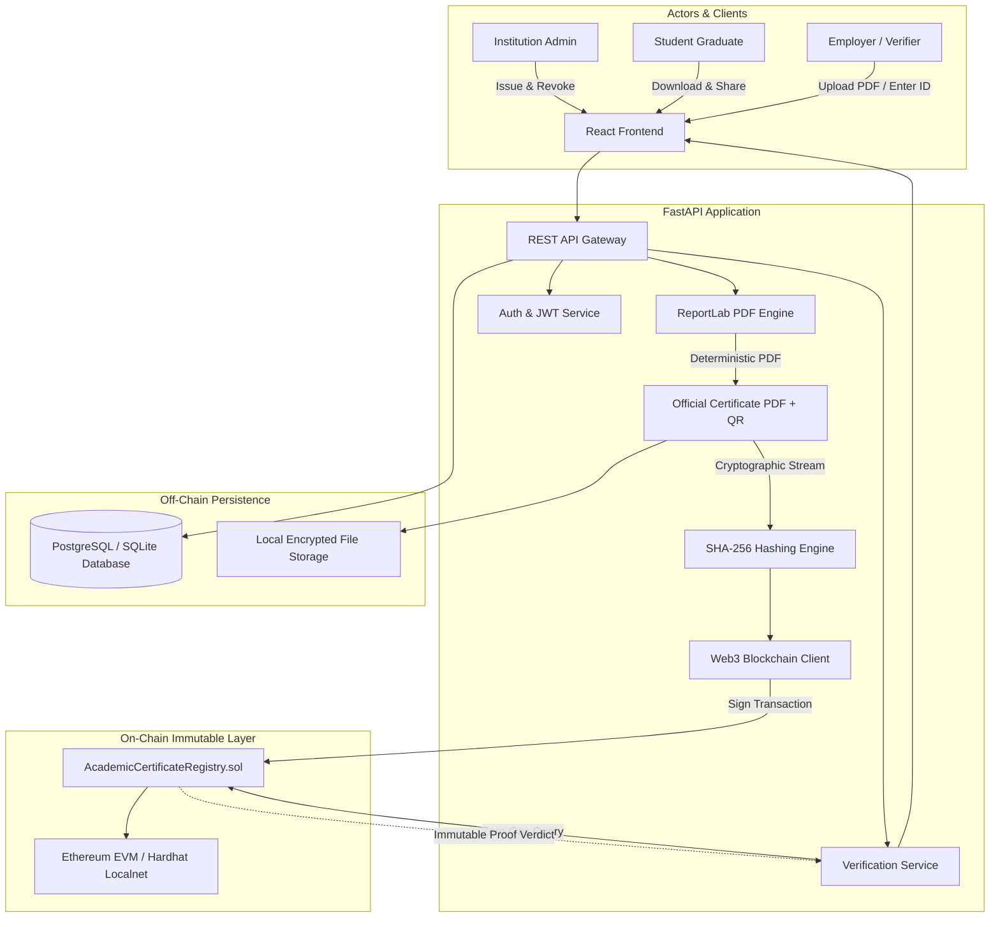

# Blockchain-Based Academic Certificate Verification System

An academic micro-project implementing a decentralized, tamper-evident credential verification platform powered by a hybrid on-chain/off-chain architecture: Ethereum EVM smart contracts (Solidity), Python (FastAPI), ReportLab PDF generation, deterministic SHA-256 hashing, and a React 18 / Tailwind CSS dashboard.

---

## 1. Project Overview

The **CertLedger** system allows accredited universities and colleges to issue cryptographically verifiable academic diplomas, enables graduates to easily share credentials with employers, and allows third parties (recruiters, licensing boards) to authoritatively verify authenticity, detect document tampering, and inspect revocation status without exposing student personally identifiable information (PII) on a public ledger.

---

## 2. Problem Statement

1. **Credential Forgery & Degree Mills**: The global rise in falsified educational credentials damages the reputation of legitimate institutions and misleads employers.
2. **Slow, Costly Manual Verification**: Traditional background checks rely on registrar phone calls, physical paper letters, and third-party clearinghouses, taking days or weeks.
3. **Privacy Violations**: Directly recording student names, grades, and identifiers onto a public blockchain permanently violates data protection laws (e.g., GDPR Article 17 "Right to Erasure", FERPA).
4. **Permanent Fraud After Issuance**: Without an on-chain revocation mechanism, fraudulent or revoked credentials can circulate undetected.

---

## 3. Objectives

- **Cryptographic Trust**: Anchor degree integrity to an immutable blockchain ledger.
- **Privacy by Design**: Zero student PII (names, IDs, grades) committed to blockchain storage.
- **Instant Tamper Detection**: Leveraging the SHA-256 avalanche effect so that altering even 1 byte invalidates the credential.
- **Dynamic Revocation**: Provide authorized institutions the ability to immediately revoke compromised credentials on-chain.
- **Usability**: Single-click PDF verification and QR-code enabled scanning for non-technical employers.

---

## 4. Architecture

CertLedger operates on a **hybrid on-chain/off-chain architecture**:



---

## 5. Technology Stack

- **Frontend**: React 18, Vite, Tailwind CSS, Lucide React, Axios, React Router Dom.
- **Backend**: Python 3.10+, FastAPI, SQLAlchemy, Pydantic v2, Web3.py, ReportLab, QRCode, Pillow, Bcrypt, PyJWT.
- **Blockchain**: Solidity `^0.8.20`, Hardhat, OpenZeppelin Contracts v5, Ethers.js v6.
- **Database**: SQLite (default zero-friction local setup) and PostgreSQL (via `docker-compose.yml`).
- **Cryptography**: SHA-256 (FIPS 180-4) document hashing and ECDSA transaction signing.

---

## 6. Blockchain Design

### State Structure:
```solidity
struct Certificate {
    bytes32 certificateHash; // SHA-256 digest of canonical PDF
    address issuer;          // Wallet address of issuing university
    uint256 issuedAt;        // Unix block timestamp
    bool revoked;            // Revocation state flag
}

mapping(bytes32 => Certificate) private certificates;
mapping(address => bool) public authorizedIssuers;
```

---

## 7. Smart Contract Functions

1. `authorizeIssuer(address _issuer) external onlyOwner`: Authorizes an accredited university wallet address.
2. `revokeIssuer(address _issuer) external onlyOwner`: Removes an institution's issuing privileges.
3. `isAuthorizedIssuer(address _issuer) external view returns (bool)`: Returns whether an address is authorized.
4. `issueCertificate(string calldata _certificateId, bytes32 _certificateHash) external onlyAuthorizedIssuer`: Mints an immutable verification record. Emits `CertificateIssued`.
5. `verifyCertificate(string calldata _certificateId, bytes32 _certificateHash) external view returns (bool exists, bool hashMatches, bool revoked, address issuer, uint256 issuedAt)`: Computes full verification state in a single call without gas costs.
6. `revokeCertificate(string calldata _certificateId) external`: Enforces that only the original issuing institution wallet can revoke a credential. Emits `CertificateRevoked`.
7. `getCertificateStatus(string calldata _certificateId) external view returns (...)`: Queries raw on-chain state by ID.

---

## 8. Privacy Design (Zero PII On-Chain)

CertLedger explicitly rejects the anti-pattern of storing student PII on-chain:
- **No Student Names**: Stored exclusively in the off-chain database and rendered on the PDF.
- **No Marks / GPA**: Grade information remains strictly confidential.
- **One-Way Digest**: Observers looking at `0x4a20...` cannot reverse-engineer student identities.
- **Compliance**: Adheres to GDPR Data Minimization and FERPA educational privacy mandates.

---

## 9. Database Design

### Relational Schema (PostgreSQL / SQLite):
1. **institutions**: `id`, `name`, `wallet_address`, `email`, `hashed_password`, `is_authorized`, `created_at`.
2. **certificates**: `id`, `certificate_id`, `student_name`, `student_id`, `degree`, `department`, `institution_id`, `graduation_year`, `certificate_type`, `issue_date`, `file_path`, `certificate_hash`, `blockchain_tx_hash`, `revoked`, `created_at`.
3. **blockchain_transactions**: `id`, `certificate_id`, `transaction_hash`, `transaction_type`, `block_number`, `timestamp`.

---

## 10. Installation

### Prerequisites
- Node.js v18+ (tested on Node v24)
- Python 3.10+
- Git

### Clone & Setup
```bash
git clone <repo-url>
cd Blockchain_Project
```

---

## 11. Configuration

Copy environment template:
```bash
cp .env.example .env
```
Default parameters are pre-configured for local testing:
- Admin Email: `admin@university.edu`
- Admin Password: `adminpassword123`
- Default Issuer Wallet: `0x70997970C51812dc3A010C7d01b50e0d17dc79C8` (Hardhat Account #1)

---

## 12. Running the Blockchain

In a dedicated terminal:
```bash
cd blockchain
npm install
npx hardhat node
```
*Hardhat node will start at `http://127.0.0.1:8545` (Chain ID: 31337).*

---

## 13. Deploying the Contract

In another terminal:
```bash
cd blockchain
npx hardhat run scripts/deploy.js --network localhost
```
*The script automatically deploys the contract, authorizes Account #1, and writes contract address and ABI to `backend/app/blockchain/contract_data.json`.*

---

## 14. Running Backend

```bash
cd backend
python -m venv venv
# On Windows:
.\venv\Scripts\Activate.ps1
# On Linux/macOS:
source venv/bin/activate

pip install -r requirements.txt
python -m uvicorn app.main:app --host 127.0.0.1 --port 8000 --reload
```
*Backend API available at `http://localhost:8000` (Swagger docs at `/docs`).*

---

## 15. Running Frontend

```bash
cd frontend
npm install
npm run dev
```
*Frontend opens at `http://localhost:5173`.*

---

## 16. Testing

### Run Smart Contract Tests (17/17 Passing)
```bash
cd blockchain
npm test
```

### Run Backend Tests (12/12 Passing)
```bash
cd backend
.\venv\Scripts\python -m pytest -v
```

---

## 17. Demo Workflow (11 Steps)

Run the automated end-to-end integration test exercising all 11 lifecycle stages on the live blockchain:
```bash
.\backend\venv\Scripts\python scripts/e2e_demo.py
```

### Walkthrough of Results:
1. **Connectivity**: Verifies Hardhat node and smart contract address.
2. **Login**: Institution signs in with JWT token.
3. **Issuance**: Student details submitted, PDF created, SHA-256 computed, mined to block #1.
4. **Download**: Original PDF diploma downloaded.
5. **Verify by ID**: Smart contract returns `VALID`.
6. **Verify by PDF**: Uploaded PDF hash matches blockchain ledger -> `VALID`.
7. **Tamper Test**: 10 bytes modified in PDF binary -> Hash mismatch -> `INVALID / MODIFIED`.
8. **Revocation**: Authorized institution calls `revokeCertificate()` -> mined to block #2.
9. **Verify Revoked**: Verifier queries certificate -> Smart contract returns `REVOKED`.
10. **Unknown Cert**: Non-existent ID returns `NOT_FOUND`.
11. **Inspector**: Live transaction details, block number, gas used, confirmations displayed.

---

## 18. Security Considerations

- **Access Modifiers**: Only contract owner can authorize issuers; only original issuer can revoke.
- **Reentrancy Immunity**: Functions perform state checks before writing; no external ether transfers.
- **Custom Errors**: Gas-efficient custom errors (`UnauthorizedIssuer`, `CertificateAlreadyExists`, etc.) replace verbose require strings.
- **Key Safety**: Production deployment requires institutional hardware security modules (HSMs).

---

## 19. Engineering Constraints Analysis

- **Storage Efficiency**: Storing complete PDFs on-chain is cost-prohibitive. Storing a 32-byte hash uses ~96,000 gas units ($0.15 vs $5,000+).
- **Scalability**: By maintaining documents off-chain, the blockchain layer scales to millions of records without ledger bloat.
- **Availability Disclaimer**: Blockchain guarantees the *integrity and existence* of the hash record, but off-chain storage backups (or decentralized IPFS pinning) are required for long-term document retrieval.

---

## 20. SDG Mapping

- **SDG 4: Quality Education**: Fosters educational transparency and eliminates fraudulent credentials.
- **SDG 9: Industry, Innovation, and Infrastructure**: Employs cutting-edge cryptographic infrastructure for public institutions.
- **SDG 16: Peace, Justice, and Strong Institutions**: Establishes transparent, tamper-proof governance for academic degrees.

---

## 21. Limitations

- **Local Development Keys**: Hardhat demo keys are used for demonstration; production requires secure KMS/HSM integration.
- **Single Institutional Node**: Running on a local Hardhat single-node testnet rather than a multi-node consortium.
- **File Storage**: Relies on local file storage rather than distributed IPFS/Filecoin nodes.

---

## 22. Future Enhancements

- **IPFS / Filecoin Integration**: Pinning canonical PDF diplomas to decentralized content-addressed storage.
- **W3C Verifiable Credentials & DIDs**: Standardizing credential schemas for decentralized identity wallets.
- **Zero-Knowledge Proofs (ZK-SNARKs)**: Enabling students to prove GPA thresholds without revealing actual scores.
- **Soulbound Tokens (EIP-5114)**: Optional non-transferable NFT representation of academic degrees.
