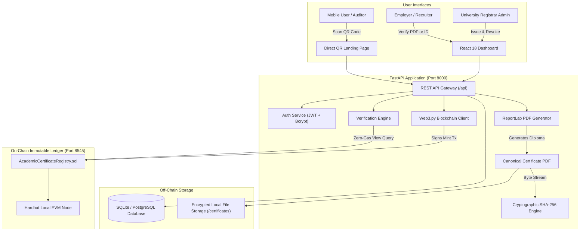

# CertLedger: Blockchain-Based Academic Certificate Verification System
## Comprehensive System Manual & Operator's Guide

---

## 1. System Overview: What Is CertLedger?

**CertLedger** is a decentralized, tamper-evident academic credential management platform. It allows accredited universities and colleges to issue cryptographically verifiable diplomas and transcripts, empowers graduates to share genuine credentials, and allows employers, universities, or licensing boards to verify credential authenticity in seconds without manual paperwork or third-party clearinghouses.

### The Fundamental Problem
1. **Diploma Fraud & Degree Mills**: Millions of fake degrees circulate worldwide because traditional paper certificates and static PDF files can easily be photoshopped or falsified.
2. **Slow, Costly Verification**: Background check companies and HR departments must call university registrars or send physical letters, taking weeks and costing significant administrative hours.
3. **Privacy & Legal Violations on Public Blockchains**: Storing student names, grades, and birth dates directly on an immutable public blockchain permanently violates data protection laws like **GDPR Article 17 ("Right to Erasure")** and **FERPA**.
4. **Unrevokable Counterfeits**: Once a physical paper diploma or PDF is distributed, the university cannot reliably revoke it if fraud or academic misconduct is discovered later.

### The Solution: Hybrid On-Chain / Off-Chain Architecture
CertLedger solves these challenges through a **Zero-PII (Personally Identifiable Information) Hybrid Architecture**:
- **On-Chain (Ethereum EVM Smart Contract)**: Only stores the 32-byte SHA-256 cryptographic digest (the "fingerprint") of the canonical diploma PDF, the issuing university's verified cryptographic wallet address, the timestamp of block confirmation, and a boolean revocation flag.
- **Off-Chain (FastAPI + Relational Database + PDF Engine)**: Stores student names, degree titles, and departmental records, and generates the official PDF diploma embedded with a cryptographic QR code.

Even if an observer monitors every transaction on the public blockchain, they see only a 64-character hexadecimal hash (`0x7f4a...`). They cannot reverse-engineer student names, grades, or personal details. Yet, if even **one single pixel or letter** in the PDF is altered, its SHA-256 hash completely changes (the cryptographic avalanche effect), immediately triggering a failed verification verdict.

---

## 2. Core Architecture & Technology Stack



### Component Breakdown
| Layer | Technologies | Responsibilities |
| :--- | :--- | :--- |
| **Frontend** | React 18, Vite, Tailwind CSS, Lucide Icons, Axios | Responsive UI for University Admins and Public Verifiers; drag-and-drop PDF dropzone; real-time certificate preview; tamper demonstration. |
| **Backend API** | Python 3.10+, FastAPI, SQLAlchemy, Pydantic v2 | Manages JWT authentication; executes ReportLab vector rendering; computes SHA-256 fingerprints; orchestrates Web3 transactions. |
| **Smart Contracts** | Solidity `^0.8.20`, OpenZeppelin Contracts v5, Hardhat | Maintains immutable mappings of authorized institutions, certificate hashes, issuance timestamps, and revocation flags. |
| **Database** | SQLite (default local) or PostgreSQL (Docker) | Holds institutional profiles, student registry data, and file paths. |
| **Cryptography** | SHA-256 (FIPS 180-4) & ECDSA (secp256k1) | Generates collision-resistant document digests and cryptographically signs blockchain transactions. |

---

## 3. How It Works: Cryptographic & Blockchain Mechanics

### Phase A: Issuance (Registrar Workflow)
1. **Form Submission**: The authorized university registrar logs in and inputs student metadata (Student Name, ID, Degree, Department, Year of Graduation).
2. **Deterministic PDF Creation**: The backend uses ReportLab to render a high-resolution certificate with vector borders, university seals, and an embedded dynamic QR code linking to `/verify/{certificate_id}`.
3. **Cryptographic Hashing**: The complete binary byte stream of the generated PDF is passed through SHA-256:
   $$\text{Hash} = \text{SHA-256}(\text{PDF Binary Data})$$
   This produces a unique 32-byte hexadecimal string (e.g., `0x3a4b9c...`).
4. **Smart Contract Minting**: The backend uses the university's private key (`Account #1`) to call `issueCertificate(certId, certHash)` on the `AcademicCertificateRegistry` contract.
5. **EVM Confirmation**: The transaction is mined into a block. The contract checks that the caller is an authorized issuer and that the certificate ID has not been used before, then records the hash and block timestamp.
6. **Local Persistence**: The transaction hash, block number, and PDF file are saved into the database and filesystem.

### Phase B: Verification (Employer / Verifier Workflow)
Verification can be performed without logging in using three distinct methods:

1. **Method 1: Certificate ID Lookup**
   - The verifier enters the Certificate ID (e.g., `CERT-2026-0001`).
   - The backend queries the smart contract via `verifyCertificate(id, storedHash)`.
   - The contract returns `(exists, hashMatches, revoked, issuer, issuedAt)`.
2. **Method 2: Direct PDF Upload (Zero-Trust Document Verification)**
   - The verifier drags and drops the student's candidate PDF file into the browser.
   - The system computes the SHA-256 hash of the uploaded file.
   - The calculated hash is compared against the immutable hash anchored on the blockchain.
   - If the hashes match and `revoked == false`, the certificate is **AUTHORITATIVE & VALID**.
3. **Method 3: QR Code Verification**
   - Anyone scanning the QR code printed on the physical or digital diploma is immediately redirected to `http://localhost:5173/verify/CERT-2026-XXXX`.
   - The system automatically retrieves the on-chain status and shows the full cryptographic audit report.

### Phase C: Tamper Detection (The Avalanche Effect)
- SHA-256 is designed such that changing even a single bit in the source document causes an unpredictable, massive change in the output hash.
- If someone edits a student's grade or name in a PDF editor, the altered document produces a completely different hash.
- When compared to the smart contract record, `hashMatches` evaluates to `false`, and the system flags the document as **TAMPERED / FORGED**.

### Phase D: Dynamic Revocation
- If an institution discovers academic dishonesty or mistakenly issues a credential, the authorized university wallet calls `revokeCertificate(certificateId)`.
- The smart contract verifies that only the original issuing wallet can revoke the diploma.
- The contract updates `revoked = true` on-chain.
- Future verification attempts will instantly display **REVOKED**, while preserving the historical block timestamp of when it was originally issued.

---

## 4. Key Features Breakdown

### 1. Registrar Command Center (Dashboard)
- **Real-Time KPIs**: Total certificates issued, active valid certificates, revoked certificates, and live blockchain node health.
- **Recent Issuances Table**: Quick-view of recently minted certificates with student names, degree titles, block numbers, and direct actions.

### 2. Certificate Issuance Studio
- **Guided Form**: Fields for Student Full Name, Student ID, Degree (Bachelor, Master, Doctorate, Diploma), Academic Department, Graduation Year, Certificate Type, and Honors/Remarks.
- **Live Diploma Preview**: Real-time visualization of what the certificate will look like before committing it to the blockchain.
- **Automatic Blockchain Signing**: Single-click submission signs the Ethereum transaction in the background, returning block number, gas used, and transaction hash.

### 3. All Certificates Registry
- Search and filter by Student Name, Degree, or Certificate ID.
- One-click PDF download for students or administration.
- View detailed metadata and blockchain receipt.
- Immediate Revocation action for authorized administrators.

### 4. Public Multi-Modal Verification Portal
- **Verification by ID**: For fast status checks.
- **Verification by PDF**: For rigorous cryptographic file audits.
- **Interactive Tamper Demonstration**: A dedicated sandbox where users can deliberately alter certificate bytes and witness the cryptographic mismatch in real time.

### 5. Detailed Blockchain Inspector
- Displays exact block number, Ethereum transaction hash, contract address, issuing wallet address, and cryptographic SHA-256 digest for audit readiness.

---

## 5. Step-by-Step Operator Walkthrough

### Prerequisites Checklist
Ensure you have the following installed on your machine:
- **Node.js**: v18+ (tested on v24)
- **Python**: 3.10+
- **Git** & **PowerShell** (Windows)

---

### Step 1: Starting the Services

Open **three separate terminal windows** in `z:\Blockchain_Project`:

#### Terminal 1 — Blockchain Node & Deployment
```powershell
cd z:\Blockchain_Project\blockchain
npx hardhat node
```
*Wait until 20 test accounts with 10,000 ETH each are displayed.*

In a second prompt (or once the node starts):
```powershell
cd z:\Blockchain_Project\blockchain
npx hardhat run scripts/deploy.js --network localhost
```
*You will see:*
```text
AcademicCertificateRegistry deployed to: 0x5FbDB2315678afecb367f032d93F642f64180aa3
Authorizing institution wallet 0x70997970C51812dc3A010C7d01b50e0d17dc79C8...
Institution wallet authorized successfully.
Deployment info saved to backend: contract_data.json
```

#### Terminal 2 — FastAPI Backend Engine
```powershell
cd z:\Blockchain_Project\backend
.\venv\Scripts\Activate.ps1
uvicorn app.main:app --host 127.0.0.1 --port 8000 --reload
```
*You will see:*
```text
[APP] Initializing database tables and seed data...
[APP] Connected to Blockchain node at http://127.0.0.1:8545
[APP] Contract Address: 0x5FbDB2315678afecb367f032d93F642f64180aa3
INFO: Application startup complete.
```

#### Terminal 3 — React Frontend Dashboard
```powershell
cd z:\Blockchain_Project\frontend
npm run dev
```
*You will see:*
```text
  VITE v5.4.21  ready in 363 ms
  ➜  Local:   http://localhost:5173/
```

---

### Step 2: Logging In as University Administrator
1. Open your web browser and navigate to **`http://localhost:5173`**.
2. Click **"Institution Login"** in the top navigation bar.
3. Enter the pre-seeded credentials:
   - **Email**: `admin@university.edu`
   - **Password**: `adminpassword123`
4. Click **"Sign In"**. You will be redirected to the **Institution Dashboard**.

---

### Step 3: Issuing a New Academic Certificate
1. On the dashboard navigation or top bar, click **"Issue Certificate"**.
2. Fill out the credential form:
   - **Student Full Name**: `Eleanor Vance`
   - **Student ID**: `STU-99420`
   - **Degree Conferred**: `Bachelor of Science in Computer Science`
   - **Department / Faculty**: `Department of Computer Science & Engineering`
   - **Graduation Year**: `2026`
   - **Certificate Type**: `Degree Certificate`
   - **Honors / Remarks**: `First Class with Distinction`
3. Notice the live diploma preview updating on the right side of the screen.
4. Click **"Issue & Mint on Blockchain"**.
5. Wait 1–2 seconds:
   - ReportLab renders the official PDF.
   - SHA-256 hash is computed.
   - Web3 transaction is broadcast to the Hardhat node.
   - The success modal appears showing the **Certificate ID** (e.g. `CERT-2026-0002`), **Transaction Hash**, and **Block Number**.
6. Click **"Download Official PDF"** to save the generated credential to your computer.

---

### Step 4: Verifying by Uploading the PDF
1. Click **"Verify Certificate"** in the top navigation bar (or log out to test as a third-party recruiter).
2. Select the **"Upload PDF Certificate"** tab.
3. Drag and drop the downloaded PDF file into the dashed dropzone (or click to browse and select it).
4. Click **"Verify Document"**.
5. The screen immediately displays:
   - **Status**: `VERIFIED & VALID` (Green Badge)
   - **SHA-256 Digest**: Matches the on-chain fingerprint exactly.
   - **Issuer**: Metropolitan State University (`0x7099...`)
   - **Timestamp**: Exact block confirmation time.

---

### Step 5: Testing the Tamper Detection Feature
To see how the blockchain catches fraudulent documents:
1. Go to the **"Verify Certificate"** page.
2. Select the **"Tamper Demonstration"** tab.
3. Choose any existing certificate from the dropdown list.
4. Click **"Simulate Byte Alteration"**.
5. The system intentionally flips 10 bytes in the binary PDF stream and re-hashes it.
6. Observe the side-by-side comparison:
   - **Original On-Chain Hash**: `0x3f98a...`
   - **Altered File Hash**: `0xb2c71...`
   - **Result**: `TAMPER DETECTED / INVALID` (Red Warning)
   - The system proves that modifying even a single character makes the certificate unverified.

---

### Step 6: Revoking a Compromised Credential
1. Return to the **Dashboard** as an administrator.
2. Navigate to **"Certificates List"**.
3. Locate the certificate you wish to revoke.
4. Click the **"Revoke"** button next to it.
5. Confirm the action in the prompt.
6. The smart contract executes `revokeCertificate()`, and the state flag updates on-chain.
7. Now go back to the **Verify Portal** and query that Certificate ID:
   - **Verdict**: `REVOKED` (Amber Warning).
   - Shows the original issuance record and notes that the credential has been invalidated by the issuing institution.

---

## 6. Smart Contract Reference: `AcademicCertificateRegistry.sol`

```solidity
struct Certificate {
    bytes32 certificateHash; // 32-byte SHA-256 document fingerprint
    address issuer;          // Wallet of issuing accredited university
    uint256 issuedAt;        // Unix block timestamp
    bool revoked;            // Revocation status
}
```

### Core Methods:
- **`authorizeIssuer(address _issuer)`** *(Owner only)*: Registers an authorized university wallet.
- **`issueCertificate(string _certificateId, bytes32 _certificateHash)`** *(Authorized issuers only)*: Records credential hash on the blockchain. Emits `CertificateIssued`.
- **`verifyCertificate(string _certificateId, bytes32 _certificateHash)`** *(Public view, zero gas)*: Returns `(bool exists, bool hashMatches, bool revoked, address issuer, uint256 issuedAt)`.
- **`revokeCertificate(string _certificateId)`** *(Original issuer only)*: Sets `revoked = true`. Emits `CertificateRevoked`.

---

## 7. Troubleshooting & FAQ

| Problem | Cause | Resolution |
| :--- | :--- | :--- |
| **"Could not connect to blockchain"** in backend logs | Hardhat node is not running on port 8545. | Run `npx hardhat node` in the `blockchain/` folder before launching FastAPI. |
| **"Smart contract is not loaded"** on issuance | Contract has not been deployed to localnet. | Run `npx hardhat run scripts/deploy.js --network localhost` in `blockchain/`. |
| **"Unauthorized Issuer"** error | Account used by backend isn't authorized. | Ensure `ISSUER_PRIVATE_KEY` corresponds to Hardhat Account #1 (`0x7099...`) which is authorized during deploy. |
| **Frontend shows Network Error** | Backend is offline or running on wrong port. | Confirm FastAPI is running at `http://127.0.0.1:8000` and Swagger docs load at `http://127.0.0.1:8000/docs`. |
| **PowerShell script execution disabled** | Windows security policy blocks `Activate.ps1`. | Run `Set-ExecutionPolicy -Scope Process -ExecutionPolicy Bypass` in your PowerShell window. |

---

## 8. Summary of Security & Compliance

1. **Zero-PII On-Chain**: No student names, marks, or personal IDs ever touch Ethereum storage, ensuring complete **GDPR Article 17** and **FERPA** compliance.
2. **Avalanche Effect**: Cryptographic SHA-256 guarantees 100% sensitivity to unauthorized tampering.
3. **Institutional Non-Repudiation**: All issuance and revocation actions are signed with ECDSA private keys and logged to immutable blocks.
4. **Instant Verification**: Third-party verifiers do not need blockchain accounts, cryptocurrency, or gas fees to verify credentials.
