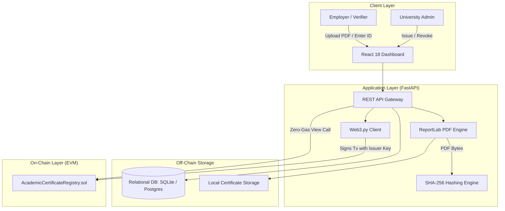

# CertLedger: Comprehensive Project Viva Voce & Technical Defense Guide
## Blockchain-Based Academic Certificate Verification System

---

## Quick Navigation Index

1. [Category 1: Project Overview, Motivation & Domain Fundamentals](#category-1-project-overview-motivation--domain-fundamentals)
2. [Category 2: System Architecture & Hybrid Design](#category-2-system-architecture--hybrid-design)
3. [Category 3: Smart Contract Engineering (Solidity & EVM)](#category-3-smart-contract-engineering-solidity--evm)
4. [Category 4: Cryptography, Hashing & Tamper Detection](#category-4-cryptography-hashing--tamper-detection)
5. [Category 5: Privacy, Legal & Regulatory Compliance (Zero-PII)](#category-5-privacy-legal--regulatory-compliance-zero-pii)
6. [Category 6: Backend Engineering, Web3.py & Database](#category-6-backend-engineering-web3py--database)
7. [Category 7: Frontend Architecture & User Experience](#category-7-frontend-architecture--user-experience)
8. [Category 8: Testing Strategy, Quality Assurance & Demo Validation](#category-8-testing-strategy-quality-assurance--demo-validation)
9. [Category 9: Real-World Deployment, Scalability, Gas & Economics](#category-9-real-world-deployment-scalability-gas--economics)
10. [Category 10: "Examiner Trap" & Rapid-Fire Defense Questions](#category-10-examiner-trap--rapid-fire-defense-questions)

---

## Category 1: Project Overview, Motivation & Domain Fundamentals

### Q1.1: What is the elevator pitch of your project?
**Short Answer:**
> **CertLedger** is a decentralized, tamper-evident academic credential verification platform. It allows accredited universities to issue cryptographically verifiable digital diplomas on an Ethereum EVM blockchain, enables graduates to share verifiable credentials, and allows employers to verify document authenticity, detect tampering, and check revocation status in seconds with zero gas fees and zero student PII on-chain.

**Technical Deep Dive:**
The system uses a **hybrid on-chain/off-chain architecture**:
- **On-chain (Solidity Smart Contract)**: Anchors a 32-byte SHA-256 cryptographic digest of the official PDF diploma, the university's authorized Ethereum wallet address, the block timestamp of issuance, and a boolean revocation status flag.
- **Off-chain (FastAPI, SQLite/PostgreSQL, ReportLab)**: Manages student academic records, generates high-resolution canonical PDF diplomas with dynamic QR codes, and provides RESTful APIs for the web interface.

---

### Q1.2: What real-world problem does this project solve?
**Short Answer:**
> It solves three massive global problems:
> 1. **Degree Forgery & Diploma Mills**: Millions of fake degrees circulate because static PDFs or paper certificates can be photoshopped easily.
> 2. **Slow, Costly Manual Background Checks**: Employers wait days or weeks for registrars to manually confirm transcripts.
> 3. **Privacy Breaches on Public Ledgers**: Naive blockchain implementations put student names and grades on public chains, violating privacy laws. CertLedger solves this with a Zero-PII cryptographic fingerprinting approach.

---

### Q1.3: Why do we need a Blockchain for this? Why not just use a centralized SQL database with an SSL/TLS API and digital signatures?
**Short Answer:**
> A centralized database suffers from a **Single Point of Failure (SPOF)**, database administrator tampering (insider threat), and institutional impermanence. If an institution shuts down or an insider alters database records, trust is lost. Blockchain provides **decentralized, immutable, timestamped, and censorship-resistant auditability** that operates independently of any single server.

**Technical Deep Dive:**
| Dimension | Centralized SQL Database | CertLedger Blockchain Registry |
| :--- | :--- | :--- |
| **Trust Model** | Trust in the server owner and DB admin | Cryptographic trust in distributed consensus |
| **Immutability** | Records can be altered with `UPDATE` or `DELETE` | Cryptographically impossible to rewrite history |
| **Availability** | Server crash or bankruptcy halts verification | Ledger remains live on distributed nodes globally |
| **Auditability** | Logs can be truncated or manipulated | Append-only public state transitions with block receipts |
| **Verification Cost** | Requires active server uptime and API keys | Anyone can query smart contract view functions for 0 gas |

---

### Q1.4: Who are the primary stakeholders and actors in your system?
**Short Answer:**
> There are three primary actors:
> 1. **Contract Administrator / Governing Body**: Deploys the contract and manages authorized university wallet addresses.
> 2. **Accredited Educational Institutions (Registrars)**: Authenticate via institutional credentials and mint/revoke academic credentials.
> 3. **Public Verifiers (Employers, Recruiters, Students)**: Upload candidate PDFs or scan QR codes to instantly verify degree legitimacy without needing an account or paying transaction fees.

---

## Category 2: System Architecture & Hybrid Design

### Q2.1: Explain the system architecture of CertLedger.
**Short Answer:**
> CertLedger uses a three-tier hybrid architecture:
> 1. **Presentation Layer**: React 18, Vite, and Tailwind CSS dashboard providing drag-and-drop PDF verification, real-time diploma preview, and an interactive byte-tampering demonstration sandbox.
> 2. **Application & Cryptography Gateway**: Python FastAPI backend with ReportLab (vector PDF generation), PyJWT (authentication), and Web3.py (RPC blockchain client).
> 3. **Immutable Persistence Layer**: Ethereum EVM smart contract (`AcademicCertificateRegistry.sol`) running on a local Hardhat node or public EVM network.



---

### Q2.2: Why did you choose a "Hybrid" on-chain/off-chain model instead of storing everything on-chain?
**Short Answer:**
> Storing raw PDFs, student names, and images directly on the blockchain is prohibitively expensive in terms of gas, slows down block propagation, and permanently violates privacy laws (GDPR/FERPA). By storing student metadata off-chain and anchoring only a 32-byte cryptographic hash on-chain, we achieve maximum security and instant verification at minimal storage cost and zero privacy risk.

**Technical Deep Dive:**
- 1 byte of storage in Ethereum SSTORE costs **20,000 gas** for a newly initialized slot.
- Storing a standard 50 KB PDF on-chain would cost over **1,000,000,000 gas** (hundreds or thousands of dollars in fees per certificate).
- Storing a `bytes32` hash takes exactly 1 storage slot (32 bytes), costing only a fraction of a cent on modern Layer 2 networks.

---

### Q2.3: Trace the step-by-step lifecycle of Issuing a Certificate.
**Short Answer:**
> 1. Registrar logs into the dashboard via JWT authentication.
> 2. Enters student details (Name, ID, Degree, Department, Year).
> 3. Backend renders a canonical PDF with ReportLab, embedding a dynamic verification QR code.
> 4. The raw binary PDF stream is hashed using SHA-256, producing a 32-byte digest (`0x...`).
> 5. Backend uses the university's private key to sign a transaction invoking `issueCertificate(certId, certHash)`.
> 6. EVM verifies the caller is an authorized issuer, confirms the ID is unique, and records the hash and block timestamp.
> 7. The transaction receipt (Tx Hash, Block Number) and PDF are persisted.

---

### Q2.4: Trace the step-by-step lifecycle of Verifying a Certificate.
**Short Answer:**
> Verification supports three entry points:
> - **By PDF Upload**: The verifier uploads the candidate PDF. The backend computes `SHA-256(uploaded_pdf_bytes)` and calls the smart contract's `verifyCertificate(certId, computedHash)`. If hashes match and `revoked == false`, it returns `VALID`.
> - **By Certificate ID**: The verifier inputs `CERT-2026-0001`. The system queries `getCertificateStatus(certId)` and returns issuer address, timestamp, and status.
> - **By QR Code**: Scanning the QR code navigates directly to `http://localhost:5173/verify/{certificate_id}`, triggering an automated audit.

---

## Category 3: Smart Contract Engineering (Solidity & EVM)

### Q3.1: Walk me through the state variables and data structures in `AcademicCertificateRegistry.sol`.
**Short Answer:**
> The contract defines:
> 1. A `Certificate` struct:
>    ```solidity
>    struct Certificate {
>        bytes32 certificateHash; // SHA-256 digest of canonical PDF
>        address issuer;          // Wallet address of issuing university
>        uint256 issuedAt;        // Unix block timestamp
>        bool revoked;            // Revocation state flag
>    }
>    ```
> 2. `mapping(bytes32 => Certificate) private certificates`: Stores certificate records keyed by `keccak256(bytes(_certificateId))`.
> 3. `mapping(address => bool) public authorizedIssuers`: Tracks which university wallet addresses have issuing privileges.

---

### Q3.2: Why is the mapping key `keccak256(bytes(_certificateId))` instead of using `string` directly?
**Short Answer:**
> In Solidity, strings are dynamically-sized byte arrays. Using `keccak256(bytes(string))` produces a fixed 32-byte hash (`bytes32`), which provides constant-time $O(1)$ lookup and significantly reduces gas consumption compared to complex string key operations.

---

### Q3.3: Why is `bytes32` used for the certificate hash instead of a hexadecimal `string`?
**Short Answer:**
> A SHA-256 digest is exactly 256 bits (32 bytes). In Solidity, `bytes32` is an elementary value type that fits into a single 256-bit EVM word (1 storage slot = 32 bytes). A string representation would require 64 to 66 ASCII characters (plus length prefix), consuming at least 3 storage slots and multiplying gas costs.

---

### Q3.4: Does calling `verifyCertificate()` or `getCertificateStatus()` cost gas?
**Short Answer:**
> **No.** Both functions are marked with the `view` modifier. When a `view` function is called externally via JSON-RPC (`eth_call`), it runs locally on the connected node without creating a transaction, consuming zero gas and requiring no wallet signature.

---

### Q3.5: Who can authorize an institution to issue degrees? Who can revoke an institution?
**Short Answer:**
> Only the contract owner (admin/accreditation board), enforced by the OpenZeppelin `onlyOwner` modifier on `authorizeIssuer(address)` and `revokeIssuer(address)`. If an unauthorized wallet attempts this, the transaction immediately reverts with `OwnableUnauthorizedAccount`.

---

### Q3.6: Who is permitted to revoke an issued certificate? Can University B revoke University A's certificate?
**Short Answer:**
> **Only the original issuing institution wallet can revoke its own certificates.**
> In `revokeCertificate(string calldata _certificateId)`:
> ```solidity
> if (cert.issuer != msg.sender) {
>     revert OnlyOriginalIssuerCanRevoke(msg.sender, cert.issuer);
> }
> ```
> Even the contract owner or another authorized university cannot revoke a credential issued by a different institution.

---

### Q3.7: Why did you use Solidity 0.8.20 Custom Errors instead of `require(condition, "Error Message")`?
**Short Answer:**
> **Gas Optimization.** Traditional `require` strings store and revert ABI-encoded strings that cost substantial deployment and runtime gas. Custom errors (e.g., `error UnauthorizedIssuer(address caller);`) compile to a 4-byte selector plus typed parameters, saving approximately 50-100 gas per check and providing structured error parameters for Web3 decoding.

---

### Q3.8: What events are emitted by your contract, and why are events important in Ethereum?
**Short Answer:**
> The contract emits four events:
> 1. `event IssuerAuthorized(address indexed issuer);`
> 2. `event IssuerRevoked(address indexed issuer);`
> 3. `event CertificateIssued(string certificateId, bytes32 indexed certificateHash, address indexed issuer, uint256 issuedAt);`
> 4. `event CertificateRevoked(string certificateId, address indexed issuer, uint256 revokedAt);`
>
> **Importance:** Events allow off-chain decentralized applications, indexing subgraphs (The Graph), and block explorers to listen to state changes via Ethereum logs at a fraction of the gas cost of persistent storage. The `indexed` keyword allows efficient bloom-filter topic filtering.

---

### Q3.9: Is this smart contract vulnerable to Re-entrancy attacks?
**Short Answer:**
> **No.** Re-entrancy attacks occur when a contract makes an external call (such as transferring Ether or calling an untrusted contract) before completing internal state updates. `AcademicCertificateRegistry` does not hold, receive, or send Ether, nor does it make external calls to untrusted addresses. Furthermore, state modifications precede event emissions (following the Checks-Effects-Interactions pattern).

---

## Category 4: Cryptography, Hashing & Tamper Detection

### Q4.1: What hashing algorithm is used for certificates, and why?
**Short Answer:**
> **SHA-256 (Secure Hash Algorithm, 256-bit, FIPS 180-4)**.
> It is chosen because:
> 1. It produces a fixed 32-byte digest perfectly matching the EVM's native 256-bit word size (`bytes32`).
> 2. It is computationally preimage resistant (one-way).
> 3. It is collision resistant ($2^{128}$ operations to find a collision under the Birthday Paradox).
> 4. It exhibits a powerful **avalanche effect**.

---

### Q4.2: Explain the "Avalanche Effect" and how it enables instant tamper detection.
**Short Answer:**
> The avalanche effect is a mathematical property of cryptographic hash functions where flipping a single input bit changes roughly 50% of the output bits in an unpredictable manner. If an attacker modifies even a single letter in a student's name, changes a grade from "B" to "A", or alters 1 pixel in a seal, the resulting SHA-256 digest completely diverges. When compared against the immutable on-chain hash, `hashMatches` evaluates to `false`, immediately flagging the file as forged.

---

### Q4.3: What is "Deterministic PDF Generation" and why is it critical in your project?
**Short Answer:**
> Standard PDF generators often embed dynamic metadata (e.g., current creation timestamp, unique file IDs, random boundary strings) every time a document is compiled. If compiling the same student record at two different times generates two different binary files, their SHA-256 hashes would never match.
> In our ReportLab implementation:
> - Fonts, margins, vector coordinates, colors, and layout are strictly deterministic.
> - The issue date rendered is the explicit graduation/issuance date, not the system clock timestamp.
> - This guarantees that re-generating or hashing the canonical PDF produces the exact same byte-level hash.

---

### Q4.4: Can an attacker reverse-engineer a student's identity or grades from the hash on the blockchain?
**Short Answer:**
> **No.** SHA-256 is mathematically non-invertible (preimage resistant). Given only $H = \text{SHA-256}(M)$, it is computationally impossible to determine the original message $M$. Since the PDF contains thousands of bytes of structured layout, fonts, and metadata, rainbow table attacks and brute-force dictionary attacks are infeasible.

---

### Q4.5: What cryptographic algorithm is used to sign transactions on Ethereum?
**Short Answer:**
> **ECDSA (Elliptic Curve Digital Signature Algorithm)** using the **secp256k1** elliptic curve. When the backend or university wallet issues a certificate, it signs the transaction with its private key. The EVM uses the signature $(r, s, v)$ to recover the signer's address via `ecrecover` and assigns it to `msg.sender`.

---

## Category 5: Privacy, Legal & Regulatory Compliance (Zero-PII)

### Q5.1: What is Personally Identifiable Information (PII) and why is storing PII on-chain a catastrophic mistake?
**Short Answer:**
> PII includes student full names, dates of birth, student ID numbers, phone numbers, and academic transcripts. Storing PII directly on an immutable blockchain creates permanent privacy leaks, exposes students to identity theft, and directly violates international data protection regulations.

---

### Q5.2: How does CertLedger comply with GDPR Article 17 ("Right to Erasure" / "Right to be Forgotten")?
**Short Answer:**
> **GDPR Article 17** requires organizations to permanently delete personal data upon request. Because blockchains are append-only and immutable, data written to a blockchain cannot be modified or deleted. CertLedger complies by design:
> - **Zero PII on-chain**: Only the cryptographic hash is stored. A hash is not reversible into personal data.
> - If a student exercises their Right to Erasure, the institution deletes the student's personal record and PDF from the off-chain database.
> - The remaining on-chain hash becomes an orphaned, anonymous 32-byte string that cannot be linked to any individual.

---

### Q5.3: How does CertLedger comply with FERPA (Family Educational Rights and Privacy Act)?
**Short Answer:**
> FERPA prohibits educational institutions from disclosing student educational records without consent. By keeping transcripts, grades, and names off the public ledger, CertLedger ensures no unauthorized party can view student performance by monitoring blockchain transactions. The student retains full ownership of their credential PDF and decides who to share it with.

---

## Category 6: Backend Engineering, Web3.py & Database

### Q6.1: Why did you choose FastAPI over Flask or Django?
**Short Answer:**
> 1. **High Concurrency & Asynchronous I/O**: Native `async/await` support handles concurrent cryptographic operations and RPC network calls efficiently.
> 2. **Automatic Schema Validation**: Pydantic v2 validates request/response payloads at runtime with detailed error messages.
> 3. **Self-Documenting API**: Automatically generates interactive OpenAPI/Swagger documentation at `/docs`.
> 4. **Speed**: Built on top of Starlette and Uvicorn, making it one of the fastest Python web frameworks.

---

### Q6.2: How does Web3.py interact with the smart contract during certificate issuance?
**Short Answer:**
> In `backend/app/blockchain/client.py`:
> 1. Formats `certificate_hash` into a 32-byte binary object (`bytes.fromhex(...)`).
> 2. Loads the university wallet account from the private key.
> 3. Queries the current account `nonce` via `w3.eth.get_transaction_count(account.address)`.
> 4. Builds the transaction payload calling `contract.functions.issueCertificate(certId, hashBytes)` with `from`, `nonce`, `gas`, and `gasPrice`.
> 5. Signs the transaction locally: `account.sign_transaction(tx, private_key=...)`.
> 6. Broadcasts the signed transaction via `w3.eth.send_raw_transaction(signed_tx.raw_transaction)`.
> 7. Awaits the receipt via `w3.eth.wait_for_transaction_receipt(tx_hash)` to capture the confirmed `blockNumber` and `gasUsed`.

---

### Q6.3: What is a `nonce` in an Ethereum transaction and why is it needed?
**Short Answer:**
> A nonce is a sequential counter representing the number of transactions sent from a given account. It prevents **replay attacks** (where an attacker broadcasts a captured valid transaction multiple times) and ensures transactions are processed in strict sequential order.

---

### Q6.4: What is your database schema and how does it relate to the blockchain?
**Short Answer:**
> CertLedger uses three relational tables:
> 1. **`institutions`**: Stores university name, wallet address, email, bcrypt-hashed password, and authorization status.
> 2. **`certificates`**: Stores off-chain metadata (student name, ID, degree, graduation year, issue date, PDF file path, computed SHA-256 hash, and confirmed blockchain transaction hash).
> 3. **`blockchain_transactions`**: Maintains a local ledger audit log tracking `transaction_hash`, `transaction_type` (`ISSUE` / `REVOKE`), `block_number`, and timestamp.
>
> The database acts as a fast query cache and PII repository, while the blockchain remains the final source of truth for authenticity.

---

## Category 7: Frontend Architecture & User Experience

### Q7.1: What frontend technologies did you select and why?
**Short Answer:**
> - **React 18**: Component-based UI with reactive hooks (`useState`, `useEffect`, `useCallback`) for real-time verification and dashboard updates.
> - **Vite**: Ultra-fast module bundling and Hot Module Replacement (HMR).
> - **Tailwind CSS**: Modern utility-first styling for glassmorphic cards, responsive layouts, and clear status badges.
> - **Lucide React**: Clean vector iconography for intuitive state representation (checkmarks, shields, alerts).
> - **Axios**: HTTP client configured with interceptors for JWT token attachment and multipart form-data uploads.

---

### Q7.2: How does the Drag-and-Drop PDF verification work in the UI?
**Short Answer:**
> The `VerifyPage.jsx` component uses HTML5 drag-and-drop event listeners (`onDragOver`, `onDrop`) to accept a `.pdf` file. When dropped, the file is bound to a `FormData` object and transmitted via `POST /api/verify/pdf` to the backend. The backend computes the hash directly from the uploaded stream, queries the smart contract, and returns the verdict to the UI within milliseconds.

---

### Q7.3: Explain how the interactive "Tamper Demonstration" feature works.
**Short Answer:**
> The tamper demo (`TamperDemo.jsx`) visually proves blockchain security to non-technical users and examiners:
> 1. A valid issued certificate is selected from the database.
> 2. The backend reads the legitimate PDF binary stream and deliberately flips 10 random bytes within the stream.
> 3. The tampered byte stream is re-hashed with SHA-256.
> 4. The UI displays a side-by-side comparison:
>    - **Original On-Chain Digest**: `0x3f98a...`
>    - **Altered Document Digest**: `0x8a1b2...`
>    - **Blockchain Verdict**: **`INVALID / TAMPERED (Hash Mismatch)`**
> This tangibly demonstrates that even a minute change in document binary renders it instantly invalid.

---

## Category 8: Testing Strategy, Quality Assurance & Demo Validation

### Q8.1: What was your overall testing strategy?
**Short Answer:**
> We implemented a rigorous three-tiered testing strategy:
> 1. **Smart Contract Unit Tests**: 17 Mocha/Chai/Ethers tests covering 100% of contract logic and access control edge cases.
> 2. **Backend Unit & Integration Tests**: 12 Pytest tests validating deterministic hashing, avalanche sensitivity, JWT security, and endpoint response schemas.
> 3. **End-to-End Live Integration Demo**: An automated 11-stage script (`scripts/e2e_demo.py`) that exercises the entire lifecycle on a running blockchain node.

---

### Q8.2: Summarize key test cases from your Smart Contract test suite (`17/17 Passing`).
**Short Answer:**
> Key test cases include:
> - **TC-SC-01 / 02**: Owner authorizes and revokes institution wallets.
> - **TC-SC-03 / 04**: Non-owner attempts to authorize/revoke $\rightarrow$ reverts with `OwnableUnauthorizedAccount`.
> - **TC-SC-05 / 06**: Authorized vs. unauthorized wallet attempts issuance $\rightarrow$ unauthorized reverts with `UnauthorizedIssuer`.
> - **TC-SC-07**: Duplicate certificate ID submission $\rightarrow$ reverts with `CertificateAlreadyExists`.
> - **TC-SC-08**: Zero hash submission (`bytes32(0)`) $\rightarrow$ reverts with `InvalidCertificateHash`.
> - **TC-SC-09 / 10**: Verify authentic hash (`hashMatches == true`) vs. tampered hash (`hashMatches == false`).
> - **TC-SC-12 / 14 / 15**: Issuer revoking certificate; unauthorized wallet or a rival university wallet attempting to revoke $\rightarrow$ reverts with `OnlyOriginalIssuerCanRevoke`.
> - **TC-SC-16**: Attempting to re-revoke an already revoked credential $\rightarrow$ reverts with `CertificateAlreadyRevoked`.

---

### Q8.3: What are the 11 steps of your End-to-End Demonstration script?
**Short Answer:**
> 1. **Node Connectivity**: Pings Hardhat node and validates contract deployment address.
> 2. **Authentication**: University logs in and receives JWT token.
> 3. **Issuance**: Mints a certificate on-chain (mined into block).
> 4. **PDF Retrieval**: Downloads the generated official diploma PDF.
> 5. **Verification by ID**: Smart contract returns `VALID`.
> 6. **Verification by PDF**: Uploads genuine PDF; hash matches on-chain $\rightarrow$ `VALID`.
> 7. **Tamper Test**: Modifies bytes in PDF; hash mismatch $\rightarrow$ `INVALID`.
> 8. **Revocation**: Authorized institution calls `revokeCertificate()` $\rightarrow$ mined into next block.
> 9. **Verify Revoked**: Querying certificate returns `REVOKED`.
> 10. **Non-Existent Certificate**: Querying fake ID returns `NOT_FOUND`.
> 11. **Inspector**: Inspects block number, gas used, and transaction confirmation.

---

## Category 9: Real-World Deployment, Scalability, Gas & Economics

### Q9.1: How much gas does issuing a certificate consume?
**Short Answer:**
> In our Hardhat test environment, `issueCertificate` consumes approximately **75,000 to 95,000 gas units**.
> This includes:
> - 1 storage write (`SSTORE`) to insert the `Certificate` struct into the mapping.
> - Calling `keccak256` on the certificate ID.
> - Access control check on `authorizedIssuers[msg.sender]`.
> - Emitting the `CertificateIssued` event with indexed topics.

---

### Q9.2: If deployed on Ethereum Mainnet, gas fees would be high. How would you handle this in production?
**Short Answer:**
> We would deploy to an **Ethereum Layer 2 (L2) Rollup** or an **Enterprise Consortium Blockchain**:
> 1. **Layer 2 Rollups (Polygon, Arbitrum, Optimism, Base)**: Fully EVM-compatible, inherit Ethereum Layer 1 security, but have transaction fees under \$0.01 and sub-second confirmation times.
> 2. **Consortium Network (Hyperledger Besu / Quorum)**: Accredited universities form a Proof of Authority (PoA) network with zero gas fees and institutional validator governance.
> 3. **Batch Minting**: Use Merkle Trees to anchor hundreds of certificates in a single root hash transaction, reducing gas per certificate to near zero.

---

### Q9.3: What happens if a university loses its private key?
**Short Answer:**
> 1. The university can no longer issue or revoke certificates from that wallet.
> 2. **However, all previously issued certificates remain 100% verifiable forever**, because the blockchain is immutable.
> 3. The contract owner (accreditation board) can call `revokeIssuer(oldAddress)` and `authorizeIssuer(newAddress)` to restore the university's issuing capabilities using a new secure wallet.

---

### Q9.4: What happens if the university shuts down or goes bankrupt? Can graduates still verify their degrees?
**Short Answer:**
> **Yes.** This is the core value proposition of blockchain decentralization. Because the verification smart contract and ledger state exist on decentralized nodes worldwide, anyone with the candidate PDF can independently verify it against the smart contract on the blockchain without contacting or relying on the university's servers.

---

### Q9.5: What if a student loses their PDF file?
**Short Answer:**
> 1. The student can log into their university portal and re-download the canonical PDF, which will generate the exact same SHA-256 hash.
> 2. Alternatively, the employer or student can verify directly via the **Certificate ID** printed on any physical copy or transcript.
> 3. In our planned future scope, the canonical PDF can also be pinned to **IPFS / Arweave** decentralized storage so it can be retrieved from any IPFS gateway.

---

## Category 10: "Examiner Trap" & Rapid-Fire Defense Questions

### Q10.1: "Can a student re-compute the hash after editing their grade and update the blockchain?"
**Examiner Trap:** Testing whether you understand blockchain access control and transaction immutability.
> **Answer:** "No, absolutely not. The student does not have the university's authorized private key, so any transaction they send to `issueCertificate` or edit the contract will revert with `UnauthorizedIssuer`. Furthermore, once a block is mined, even the university cannot edit an existing block's data—they can only append a revocation transaction."

---

### Q10.2: "If the blockchain is immutable, how can a certificate be revoked?"
**Examiner Trap:** Confusing immutability with mutable application state.
> **Answer:** "Immutability means previous blocks and historical transactions cannot be deleted or rewritten. Revocation is not deleting the record; it is an **append-only state update**. The smart contract updates the boolean variable `revoked = true` in a new transaction. Both the original issuance transaction and the revocation transaction remain permanently visible on the ledger, providing a complete historical audit trail."

---

### Q10.3: "Why not store the PDF directly on IPFS and just put the IPFS CID on the blockchain?"
**Examiner Trap:** Testing whether you understand the difference between document hashing and distributed storage.
> **Answer:** "Storing on IPFS is an excellent complementary storage solution, but IPFS addresses content using a Content Identifier (CID) which requires an IPFS daemon/gateway to resolve. Anchoring a standard SHA-256 digest on-chain allows direct, offline zero-dependency file verification: anyone with a standard SHA-256 utility in Python, Linux (`sha256sum`), or Javascript can verify the file without depending on IPFS node pinning or gateway availability."

---

### Q10.4: "Why did you use SHA-256 for the certificate PDF and Keccak-256 for the contract mapping key?"
**Examiner Trap:** Checking your understanding of cryptographic standards across web and EVM layers.
> **Answer:**
> - **SHA-256** is the universal standard for file integrity (NIST FIPS 180-4), universally supported across all operating systems, web browsers, and enterprise tools.
> - **Keccak-256** is the EVM's native internal cryptographic primitive used by Solidity for mapping keys, function selectors, and address generation. We use Keccak-256 inside the contract for gas-efficient string hashing and SHA-256 for document fingerprinting.

---

### Q10.5: "What is the difference between an ERC-721 NFT and your custom registry contract? Why didn't you make certificates ERC-721 tokens?"
**Examiner Trap:** Probing token standards vs. institutional registries.
> **Answer:** "Standard ERC-721 NFTs are **transferable assets**. Academic degrees must be non-transferable—a graduate cannot sell or transfer their degree to someone else! Using ERC-721 would require overriding transfer functions to make them **Soulbound Tokens (SBT / EIP-5192)**. Our custom registry contract is purpose-built, highly gas-optimized, avoids unnecessary NFT marketplace overhead, and directly models institutional authorization, document hashing, and revocation."

---

### Q10.6: "What happens if the university registrar enters the wrong student name before minting?"
**Examiner Trap:** Real-world human error handling.
> **Answer:** "Because the blockchain is immutable, the incorrect record cannot be erased. Instead, the registrar follows standard institutional audit procedure:
> 1. Call `revokeCertificate()` on the erroneous certificate ID, setting its status to `REVOKED`.
> 2. Issue a corrected certificate with a new unique certificate ID (e.g., `CERT-2026-0002-CORR`).
> 3. Both events remain transparently auditable on the blockchain."

---

### Q10.7: "What is a 51% attack, and could an attacker use it to forge degrees in your system?"
**Examiner Trap:** Blockchain security fundamentals.
> **Answer:** "A 51% attack occurs when a single entity controls more than 50% of the network's mining hashrate (PoW) or staked capital (PoS), allowing them to reorganize recent blocks or execute double-spends. However, **a 51% attack cannot forge digital signatures**. Even with 51% hash power, an attacker cannot forge the university's private key to sign an `issueCertificate` transaction. Furthermore, in an enterprise PoA or Ethereum L2, consensus is governed by identified validator nodes."

---

### Q10.8: "What are the key limitations of your current system and how will you expand it?"
**Examiner Trap:** Assessing self-awareness, critical thinking, and future vision.
> **Answer:**
> 1. **Decentralized Storage**: Currently files are stored off-chain on disk/DB; we plan to integrate **IPFS / Arweave** for decentralized PDF retrieval.
> 2. **Multi-Signature Governance**: Currently one university private key signs transactions; we plan to implement **Gnosis Safe multi-sig** requiring approval from both the Dean and the Registrar.
> 3. **Decentralized Identifiers (W3C DIDs) & Verifiable Credentials**: Transition to W3C VC standards and zero-knowledge proofs (zk-SNARKs) so students can prove they have a degree without revealing their GPA or graduation year.
> 4. **L2 Mainnet Deployment**: Deploy on Arbitrum or Polygon for production-grade, low-cost public verification.

---

## Quick Reference Summary Table for the Viva Panel

| Parameter | Specification in CertLedger |
| :--- | :--- |
| **Blockchain Network** | Ethereum EVM (Local Hardhat Node, Chain ID: 31337) |
| **Smart Contract Language** | Solidity `^0.8.20` |
| **Security & Standards** | OpenZeppelin `Ownable.sol`, Custom Errors |
| **Document Hash Algorithm** | SHA-256 (FIPS 180-4), 32-byte hexadecimal |
| **Contract Hash Type** | `bytes32` (256-bit word) |
| **State Mapping Key** | `keccak256(bytes(certificateId))` |
| **Verification Gas Cost** | **0 Gas** (`view` function via `eth_call`) |
| **Issuance Gas Cost** | $\approx 85,000$ gas units |
| **Backend Framework** | Python 3.10+, FastAPI, Web3.py, SQLAlchemy |
| **PDF Generation Engine** | ReportLab (Vector Graphic Canvas + Embedded QR) |
| **Frontend Stack** | React 18, Vite, Tailwind CSS, Lucide React, Axios |
| **Authentication** | JSON Web Tokens (PyJWT) + Bcrypt Password Hashing |
| **Smart Contract Tests** | **17 / 17 Passing** (Mocha / Chai / Ethers.js) |
| **Backend Tests** | **12 / 12 Passing** (Pytest) |
| **E2E Demo Stages** | **11 Automated Stages** (`scripts/e2e_demo.py`) |
